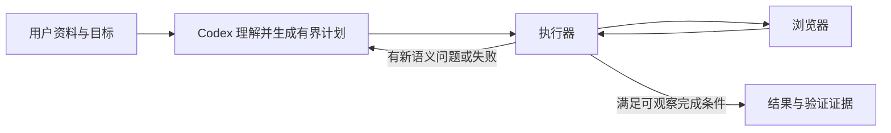

# ADR-0001：围绕宿主关键路径验证加速价值

## 状态

Proposed。用户已要求当前只用 Codex 测试；更改运行时范式尚未确认，本次仅做诊断实验。

## 背景与要求

目标是降低正确完成网页填写的端到端耗时，保持正确率，不增加默认模型 API Key。第一真实场景是秋招网申，仍缺真实网站案例。用户优先考虑明显提速和开源传播价值。扩展与本地核心应维持清晰的权限与验证边界。

当前执行层慢主要来自固定等待，但它在 Codex 总耗时中的占比很小。因此先重写 DOM 执行器不能证明两倍提速；需验证更上层的干预。

## 候选决策

在 Codex 中做“目标级计划执行”对照实验：宿主一次确定字段值、分组数量、依赖顺序与可观察完成条件；执行器处理预期内的状态变化，遇到新的语义不确定性或失败时才返回宿主。底层优先使用现有浏览器执行能力。

## 取舍与失败模式

收益假设：减少模型往返、重复页面描述和机械步骤的重新规划。仅需本地执行组件，不新增模型服务。

成本：计划语言/支持的控件范围会增加维护负担；成熟批量脚本已能表达类似逻辑，必须证明降低了模型规划或恢复成本，不能把封装等同于技术优势。

失败模式：页面变化导致旧计划失效；新出现字段的语义不明确；异步校验超出可观察范围；错误页面/权限变化；模型给出错误事实。保留目标页面绑定、观察到的元素校验、明确的停止/返回条件。页面内容是数据，不能变成执行指令；不执行不受约束的模型生成脚本。

## 比较的其他方案

1. **只优化现有固定等待**：应改善局部实现，但总体上限太小，不能作为主要产品论据。
2. **薄 Skill＋成熟批量浏览器工具**：维护成本低，是必须保留的强基线；如果新核心没有显著收益，应优先这个方案。
3. **验证后的站点流程复用**：可能减少重复任务的重新规划；增加站点漂移与失效恢复成本，且首次使用仍需规划。作为后续候选，不直接承诺通用性。
4. **换专用高速模型**：可能降低决策延迟，但改变额外 API 配置/服务依赖，与当前默认目标有张力，本轮不采用。

## 下一步验收

相同 Codex、模型、任务、浏览器状态、验证标准与审批策略；交替多次执行，统计完整耗时、模型回合、失败和人工修正。区分冷启动与已启动会话，区分首次任务与重复任务。完整任务尚未达到两倍门槛前，不将执行层的局部倍数作为产品结论。

## 证据

- [第一性原理诊断报告](../reports/FIRST-PRINCIPLES.md)
- [消融原始数据](../reports/diagnosis-ablation.json)
- [Codex 调用时间线](../reports/host-smoke.json)
